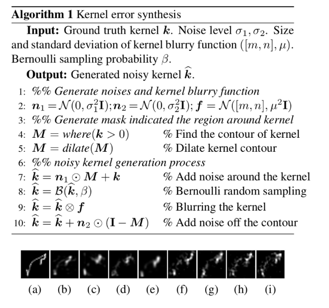

# Non-blind deconvolution methods benchmark

A benchmark for non-blind deconvolution methods: classical algorithms vs SOTA neural models.

---

## **Installation**

1. Install requirements (python >= 3.9):

```
make install
```

2. Download prepared data:

```
TODO
```

or

Download raw data:

```
TODO
```

and unpack it:

```
make prepare_raw_data
```

## **Validation**

Just simply run:
```
make test
```

---

## **Sources of data**

### Kernels:

1. Motion blur:

    1.1 Levin et al. Understanding and evaluating blind deconvolution algorithms. [Paper](https://ieeexplore.ieee.org/abstract/document/5206815), [data source](https://webee.technion.ac.il/people/anat.levin/). Total: 8 kernels.

    1.2 Sun et al. Edge-based Blur Kernel Estimation Using Patch Priors. [Paper & data source](https://cs.brown.edu/people/lbsun/deblur2013/deblur2013iccp.html). Total: 8 kernels (img_1_kernel{i}_OurNat5x5_kernel.png).

    1.3 Generated with simulator taken from [RGDN](https://github.com/donggong1/learn-optimizer-rgdn). Source code: `src/data/generate/motion_blur.py`. 


2. Eye PSF:

    2.1 Generated with our own simulator. Size: 256*256.

3. Gauss:

    3.1 Generated with [this script](https://github.com/birdievera/Anisotropic-Gaussian/blob/master/gaussian_filter.py).


### Ground truth images

1. [BSDS300](https://www2.eecs.berkeley.edu/Research/Projects/CS/vision/grouping/segbench/)

2. [Sun et al](https://cs.brown.edu/people/lbsun/deblur2013/deblur2013iccp.html). Images are taken from [here](https://drive.google.com/drive/folders/1Mb_mhtLG6N7CwiCMBnBMlJZyaqxQM-Nl).

3. Precompensation dataset [TBA]


### Discretization

There only two types of image in these datasets: PNG with floating points and JPEG with uint8 dtype. Both are stored in sRGB.
To properly model the blurring process, the convolution with PSF must be done in linear space, so the first step is to convert the floating sRGB to floating linear. The following pipeline is described [here](docs/Deconvolution%20Pipeline.drawio.pdf).


For PNG images was applied the following pipeline:
1. Read image in float, translate it to gray if necessary, convolve it, and then restore it;
2. Translate groud truth image and blurred image from *lin float* to *linRGB 16 bit*, and then restore it;
3. Translate groud truth image and blurred image from  *linRGB 16 bit* to *sRGB 8 bit*, and then restore it.

For JPG images:
1. Read image in *sRGB 8 bit*, translate it to gray if necessary, convolve it, and then restore it;


---

## **Models and algorithms**

1. Wiener filter (as baseline): source code in `src/deconv/classic/wiener.py`;

2. [USRNet](https://github.com/cszn/USRNet): source code in `src/deconv/neural/usrnet`;

3. [DWDN](https://github.com/dongjxjx/dwdn): source code in `src/deconv/neural/dwdn`;

4. [KerUnc](https://github.com/ysnan/NBD_KerUnc): source code in `src/deconv/neural/kerunc`;

5. [RGDN](https://github.com/donggong1/learn-optimizer-rgdn): source code in `src/deconv/neural/rgdn`.


Example of each model inference can be found [here](notebooks/models.ipynb).


### Testing robustness to kernels errors


Testing was done with an algorithm from a paper
[``Deep Learning for Handling Kernel/model Uncertainty in Image Deconvolution``](https://openaccess.thecvf.com/content_CVPR_2020/papers/Nan_Deep_Learning_for_Handling_Kernelmodel_Uncertainty_in_Image_Deconvolution_CVPR_2020_paper.pdf):



---

## **Tips**

### SQL

- If you work in VS Code, you can use this [extention for SQLLite](https://marketplace.visualstudio.com/items?itemName=alexcvzz.vscode-sqlite) to make your work easier.

- To calculate statistics (e.g. std and median), [this extention](https://github.com/nalgeon/sqlean/blob/main/docs/install.md) is used here. Just download precompiled binaries suitable for your OS and unpack them to a folder (`sqlean` in my case). That's it!

- SQL queries to analyze benchmarking results can be found [here](results/queries.sql).

### Running the code

- If old torch version (we use 1.7.1 since we took the source code for neural models as is) is not compatible with your CUDA version, you can run this code in Docker container. Instructures are below.

---


## **How to run docker container**

1. Build image:

```
make build
```

2. Run container:

```
make run
```

3. Execute inside the container:

```
make exec
```

4. Run inside the container:

```
make test
```

---

## Benchmarking results

It should be noted, that only *motion blur* is the type of blur common for all models, so the most correct comparison of models should be done by this domain.

<table><tr><th>discretization</th><th>noised</th><th>blur_type</th><th>model</th><th>MEDIAN(psnr)</th><th>AVG(psnr)</th><th>STD(psnr)</th><th>MEDIAN(ssim)</th><th>AVG(ssim)</th><th>STD(ssim)</th><tr><tr><td>float</td><td>0</td><td>eye_blur</td><td>dwdn</td><td>18.2979494272932</td><td>18.6816406221811</td><td>3.60612788880561</td><td>0.721355699510627</td><td>0.698177061972558</td><td>0.136397777681533</td></tr><tr><td>float</td><td>0</td><td>eye_blur</td><td>kerunc</td><td>19.6489899617122</td><td>20.7099548352584</td><td>4.68484012080575</td><td>0.72755048566639</td><td>0.714287905842598</td><td>0.152313411009697</td></tr><tr><td>float</td><td>0</td><td>eye_blur</td><td>usrnet</td><td>29.9265832311236</td><td>30.714164443593</td><td>5.21379666406214</td><td>0.972284156386852</td><td>0.932296259920897</td><td>0.0863303469306043</td></tr><tr><td>float</td><td>0</td><td>eye_blur</td><td>wiener_blind_noise</td><td>21.334742017977</td><td>21.5481768012399</td><td>3.66211245769264</td><td>0.806757182935577</td><td>0.791758872718067</td><td>0.105577767927092</td></tr><tr><td>float</td><td>0</td><td>eye_blur</td><td>wiener_nonblind_noise</td><td>34.0525603278254</td><td>35.9123802152667</td><td>10.8606387125964</td><td>0.984846091466904</td><td>0.980808006988552</td><td>0.0175242849378679</td></tr><tr><td>float</td><td>0</td><td>gauss_blur</td><td>dwdn</td><td>21.8035838044423</td><td>22.9202954020372</td><td>4.4389921176592</td><td>0.82118883539221</td><td>0.802959778981778</td><td>0.105543191578071</td></tr><tr><td>float</td><td>0</td><td>gauss_blur</td><td>kerunc</td><td>23.2837752012241</td><td>23.5852980560404</td><td>4.34245831571284</td><td>0.821104695728238</td><td>0.812219275315617</td><td>0.111104516856391</td></tr><tr><td>float</td><td>0</td><td>gauss_blur</td><td>usrnet</td><td>27.4726779025614</td><td>28.2001854380877</td><td>4.84848326971998</td><td>0.945007787864327</td><td>0.912305736979036</td><td>0.0848204835163158</td></tr><tr><td>float</td><td>0</td><td>gauss_blur</td><td>wiener_blind_noise</td><td>22.7124738720657</td><td>22.603160436592</td><td>3.8067164560756</td><td>0.845448283098012</td><td>0.821815448322193</td><td>0.0895952421780158</td></tr><tr><td>float</td><td>0</td><td>gauss_blur</td><td>wiener_nonblind_noise</td><td>25.2562949980666</td><td>26.6112480838288</td><td>5.88236886182427</td><td>0.923197019291652</td><td>0.913131193164603</td><td>0.066308481796098</td></tr><tr><td>float</td><td>0</td><td>motion_blur</td><td>dwdn</td><td>33.5821891739765</td><td>33.7941714095871</td><td>3.3272450428313</td><td>0.987101695354164</td><td>0.981714996014338</td><td>0.0155527204522927</td></tr><tr><td>float</td><td>0</td><td>motion_blur</td><td>kerunc</td><td>32.4888384687554</td><td>32.4543576209583</td><td>3.89727178078991</td><td>0.979186630611181</td><td>0.973189210994166</td><td>0.0219649769214105</td></tr><tr><td>float</td><td>0</td><td>motion_blur</td><td>usrnet</td><td>46.6643441658184</td><td>46.2263502312881</td><td>2.83284339181258</td><td>0.999208978798389</td><td>0.997800386076264</td><td>0.0025164565462504</td></tr><tr><td>float</td><td>0</td><td>motion_blur</td><td>wiener_blind_noise</td><td>28.9552930480271</td><td>29.133113210045</td><td>4.93631586082179</td><td>0.967790082651615</td><td>0.966908539682356</td><td>0.0174543526018146</td></tr><tr><td>float</td><td>0</td><td>motion_blur</td><td>wiener_nonblind_noise</td><td>73.1789780165845</td><td>63.9424793439304</td><td>24.0451455468116</td><td>0.999992177080631</td><td>0.996965284224924</td><td>0.00879753983774647</td></tr><tr><td>float</td><td>1</td><td>eye_blur</td><td>dwdn</td><td>18.1843786063389</td><td>18.4973936058989</td><td>3.43314124597361</td><td>0.696758315083618</td><td>0.678722997201267</td><td>0.132150239964432</td></tr><tr><td>float</td><td>1</td><td>eye_blur</td><td>kerunc</td><td>19.7989265494481</td><td>20.3338572834296</td><td>4.38731883049016</td><td>0.717861647899368</td><td>0.699317666186956</td><td>0.152015143011518</td></tr><tr><td>float</td><td>1</td><td>eye_blur</td><td>usrnet</td><td>24.3125218653606</td><td>25.0094324885054</td><td>4.41603429614975</td><td>0.86874520646133</td><td>0.837815454875707</td><td>0.130790248366173</td></tr><tr><td>float</td><td>1</td><td>eye_blur</td><td>wiener_blind_noise</td><td>18.0090341349257</td><td>18.6564830322171</td><td>2.69565780666271</td><td>0.49600108933071</td><td>0.513871571326227</td><td>0.113116795990334</td></tr><tr><td>float</td><td>1</td><td>eye_blur</td><td>wiener_nonblind_noise</td><td>19.3920265690937</td><td>19.9189843326171</td><td>2.81794117584314</td><td>0.645021131913359</td><td>0.647734950594812</td><td>0.110964672088332</td></tr><tr><td>float</td><td>1</td><td>gauss_blur</td><td>dwdn</td><td>21.6909814625042</td><td>22.7827326069902</td><td>4.28181068327991</td><td>0.817164003484987</td><td>0.796758575668365</td><td>0.10794941530868</td></tr><tr><td>float</td><td>1</td><td>gauss_blur</td><td>kerunc</td><td>23.0271903795524</td><td>23.3966047273534</td><td>4.33973314583498</td><td>0.810215932309225</td><td>0.79941105775293</td><td>0.116490403444023</td></tr><tr><td>float</td><td>1</td><td>gauss_blur</td><td>usrnet</td><td>25.4628921549677</td><td>26.6071029177183</td><td>4.50819254407396</td><td>0.927012726760705</td><td>0.884997071882641</td><td>0.101257195370794</td></tr><tr><td>float</td><td>1</td><td>gauss_blur</td><td>wiener_blind_noise</td><td>21.6909470205388</td><td>21.6477113376275</td><td>2.74255852619606</td><td>0.666323071441383</td><td>0.676326725199108</td><td>0.0784707506559051</td></tr><tr><td>float</td><td>1</td><td>gauss_blur</td><td>wiener_nonblind_noise</td><td>22.1355479089866</td><td>22.022308835526</td><td>3.31455517588387</td><td>0.774598283302277</td><td>0.760852733896831</td><td>0.0865535196452738</td></tr><tr><td>float</td><td>1</td><td>motion_blur</td><td>dwdn</td><td>31.6168434593848</td><td>31.58718054506</td><td>2.95746918336841</td><td>0.977850104522884</td><td>0.964627067886109</td><td>0.0318214951865523</td></tr><tr><td>float</td><td>1</td><td>motion_blur</td><td>kerunc</td><td>30.0770076418103</td><td>29.6230130959033</td><td>3.4760701664039</td><td>0.957437593844414</td><td>0.942713339468915</td><td>0.0452331729616659</td></tr><tr><td>float</td><td>1</td><td>motion_blur</td><td>usrnet</td><td>35.8478280033159</td><td>35.6179979454506</td><td>3.25422731480358</td><td>0.987381183000088</td><td>0.976495794651166</td><td>0.0237579825095177</td></tr><tr><td>float</td><td>1</td><td>motion_blur</td><td>wiener_blind_noise</td><td>25.8817647885962</td><td>25.7693788278699</td><td>1.85813135477677</td><td>0.798032377103567</td><td>0.796372046463514</td><td>0.057908515986377</td></tr><tr><td>float</td><td>1</td><td>motion_blur</td><td>wiener_nonblind_noise</td><td>25.3269698492746</td><td>25.5837310693676</td><td>2.9307562220116</td><td>0.877375179533839</td><td>0.874338866804754</td><td>0.036392586692665</td></tr><tr><td>linrgb_16bit</td><td>0</td><td>eye_blur</td><td>dwdn</td><td>16.6641654044783</td><td>17.3146978154886</td><td>4.19348216094968</td><td>0.660728174794047</td><td>0.654435937736364</td><td>0.131610163569217</td></tr><tr><td>linrgb_16bit</td><td>0</td><td>eye_blur</td><td>kerunc</td><td>17.3654949993959</td><td>18.2014432662325</td><td>5.0286594619392</td><td>0.632415515998637</td><td>0.608629016539633</td><td>0.210771925652769</td></tr><tr><td>linrgb_16bit</td><td>0</td><td>eye_blur</td><td>usrnet</td><td>15.738019734455</td><td>16.009421085944</td><td>5.18337777323369</td><td>0.482312378273946</td><td>0.518783444355452</td><td>0.193548346241926</td></tr><tr><td>linrgb_16bit</td><td>0</td><td>eye_blur</td><td>wiener_blind_noise</td><td>13.9511667677879</td><td>13.9256263491699</td><td>4.6954163703594</td><td>0.45610648683734</td><td>0.465633377539387</td><td>0.187269651925504</td></tr><tr><td>linrgb_16bit</td><td>0</td><td>eye_blur</td><td>wiener_nonblind_noise</td><td>14.2925805855821</td><td>14.3878659365287</td><td>4.52579081212664</td><td>0.481579740078229</td><td>0.495220067659118</td><td>0.187064842812454</td></tr><tr><td>linrgb_16bit</td><td>0</td><td>gauss_blur</td><td>dwdn</td><td>19.5780225989293</td><td>20.695564272348</td><td>4.54190721506382</td><td>0.799870655151828</td><td>0.786033573179304</td><td>0.10261435668258</td></tr><tr><td>linrgb_16bit</td><td>0</td><td>gauss_blur</td><td>kerunc</td><td>20.3189586036765</td><td>21.2048226202626</td><td>4.5905392646703</td><td>0.801847238474184</td><td>0.79005100529637</td><td>0.111002891615279</td></tr><tr><td>linrgb_16bit</td><td>0</td><td>gauss_blur</td><td>usrnet</td><td>18.1993721752929</td><td>18.4473834944569</td><td>5.32292644649345</td><td>0.783783400487463</td><td>0.746728578636452</td><td>0.155258801503389</td></tr><tr><td>linrgb_16bit</td><td>0</td><td>gauss_blur</td><td>wiener_blind_noise</td><td>19.4770039622498</td><td>19.8332401220231</td><td>4.25068884663961</td><td>0.769129593723923</td><td>0.755816357900916</td><td>0.118102156723525</td></tr><tr><td>linrgb_16bit</td><td>0</td><td>gauss_blur</td><td>wiener_nonblind_noise</td><td>19.5519570354071</td><td>19.7090821052091</td><td>4.14549064843909</td><td>0.777893328040563</td><td>0.758582775918944</td><td>0.111910780579091</td></tr><tr><td>linrgb_16bit</td><td>0</td><td>motion_blur</td><td>dwdn</td><td>25.8022766516761</td><td>26.1102422333914</td><td>5.10171620862173</td><td>0.936429451742768</td><td>0.919664138621356</td><td>0.0521546671246844</td></tr><tr><td>linrgb_16bit</td><td>0</td><td>motion_blur</td><td>kerunc</td><td>26.6595489575147</td><td>26.6570488361342</td><td>4.82286733837764</td><td>0.934253488132856</td><td>0.916860500485068</td><td>0.0619419281882852</td></tr><tr><td>linrgb_16bit</td><td>0</td><td>motion_blur</td><td>usrnet</td><td>22.9575529586067</td><td>23.6873286105518</td><td>6.48105500375604</td><td>0.825084830657452</td><td>0.756749232865113</td><td>0.19487230751115</td></tr><tr><td>linrgb_16bit</td><td>0</td><td>motion_blur</td><td>wiener_blind_noise</td><td>21.7176141123762</td><td>21.8396218567102</td><td>4.77051205689596</td><td>0.834975126792186</td><td>0.780925381012619</td><td>0.155997719630277</td></tr><tr><td>linrgb_16bit</td><td>0</td><td>motion_blur</td><td>wiener_nonblind_noise</td><td>21.6152487905285</td><td>21.4784901233864</td><td>4.42372288367734</td><td>0.830120688458841</td><td>0.796964086875464</td><td>0.135316837365138</td></tr><tr><td>linrgb_16bit</td><td>1</td><td>eye_blur</td><td>dwdn</td><td>14.8140022557893</td><td>16.0984926574143</td><td>4.40584729518126</td><td>0.61099480128814</td><td>0.609334495508894</td><td>0.123875326251624</td></tr><tr><td>linrgb_16bit</td><td>1</td><td>eye_blur</td><td>kerunc</td><td>15.7019145269626</td><td>16.2646036924126</td><td>5.28377465002768</td><td>0.572895581113288</td><td>0.556224045535659</td><td>0.190021482049055</td></tr><tr><td>linrgb_16bit</td><td>1</td><td>eye_blur</td><td>usrnet</td><td>15.0990528916722</td><td>12.4212783648204</td><td>9.18246535839</td><td>0.446474979874081</td><td>0.415641078658553</td><td>0.234999817395538</td></tr><tr><td>linrgb_16bit</td><td>1</td><td>eye_blur</td><td>wiener_blind_noise</td><td>11.7635574393139</td><td>11.4170194809184</td><td>4.88197403929949</td><td>0.279214085881612</td><td>0.283904402011451</td><td>0.134150237854999</td></tr><tr><td>linrgb_16bit</td><td>1</td><td>eye_blur</td><td>wiener_nonblind_noise</td><td>12.7667583057561</td><td>12.2805849410728</td><td>4.94419795525067</td><td>0.358539322635713</td><td>0.366653409855275</td><td>0.163716203437909</td></tr><tr><td>linrgb_16bit</td><td>1</td><td>gauss_blur</td><td>dwdn</td><td>17.6483888361158</td><td>17.9985128680607</td><td>6.67147448154469</td><td>0.686192197939244</td><td>0.69744409119675</td><td>0.149471342271996</td></tr><tr><td>linrgb_16bit</td><td>1</td><td>gauss_blur</td><td>kerunc</td><td>18.1997589315593</td><td>17.9636032117904</td><td>7.05616461330536</td><td>0.674031186075639</td><td>0.683861873558852</td><td>0.166134683795341</td></tr><tr><td>linrgb_16bit</td><td>1</td><td>gauss_blur</td><td>usrnet</td><td>10.5270584880093</td><td>11.5921731008461</td><td>10.4627221454029</td><td>0.642802000586352</td><td>0.626305208488336</td><td>0.203289118976738</td></tr><tr><td>linrgb_16bit</td><td>1</td><td>gauss_blur</td><td>wiener_blind_noise</td><td>16.3341147912807</td><td>15.0797585732193</td><td>6.64319581095607</td><td>0.485190142854055</td><td>0.488101782245844</td><td>0.197652812016649</td></tr><tr><td>linrgb_16bit</td><td>1</td><td>gauss_blur</td><td>wiener_nonblind_noise</td><td>16.2012583871039</td><td>15.7862649057805</td><td>6.53595919223028</td><td>0.587843261390493</td><td>0.588378117297522</td><td>0.183742612838323</td></tr><tr><td>linrgb_16bit</td><td>1</td><td>motion_blur</td><td>dwdn</td><td>20.991172109267</td><td>19.4912763978831</td><td>9.00192522317834</td><td>0.855411598157223</td><td>0.779554419757537</td><td>0.180659302347651</td></tr><tr><td>linrgb_16bit</td><td>1</td><td>motion_blur</td><td>kerunc</td><td>20.3044261525052</td><td>18.7340164331288</td><td>8.84741843834097</td><td>0.781074440079665</td><td>0.716611613733495</td><td>0.19061890258232</td></tr><tr><td>linrgb_16bit</td><td>1</td><td>motion_blur</td><td>usrnet</td><td>12.3418177102906</td><td>14.7022020780916</td><td>11.8814666698134</td><td>0.636309648385786</td><td>0.576369720872636</td><td>0.302943461502764</td></tr><tr><td>linrgb_16bit</td><td>1</td><td>motion_blur</td><td>wiener_blind_noise</td><td>14.7758399396681</td><td>15.4482196194819</td><td>7.5848719668829</td><td>0.507429220740708</td><td>0.475508131762927</td><td>0.266558782198505</td></tr><tr><td>linrgb_16bit</td><td>1</td><td>motion_blur</td><td>wiener_nonblind_noise</td><td>15.5462535777163</td><td>15.9188648359403</td><td>7.33713653455532</td><td>0.670703064608158</td><td>0.562402391127477</td><td>0.257971310032797</td></tr><tr><td>srgb_8bit</td><td>0</td><td>eye_blur</td><td>dwdn</td><td>19.111135239839</td><td>19.9371951992613</td><td>4.51550365813827</td><td>0.715334574808817</td><td>0.693030619634238</td><td>0.155938586281995</td></tr><tr><td>srgb_8bit</td><td>0</td><td>eye_blur</td><td>kerunc</td><td>21.7799260189552</td><td>22.3949712763155</td><td>5.42068295003291</td><td>0.736406001060331</td><td>0.715920132252385</td><td>0.169832544864686</td></tr><tr><td>srgb_8bit</td><td>0</td><td>eye_blur</td><td>usrnet</td><td>27.941773943875</td><td>28.0929477563834</td><td>5.98728163027281</td><td>0.905602327170253</td><td>0.855664748105952</td><td>0.147824655976558</td></tr><tr><td>srgb_8bit</td><td>0</td><td>eye_blur</td><td>wiener_blind_noise</td><td>20.8223287141167</td><td>21.0430758975687</td><td>4.46151162686007</td><td>0.786779213979014</td><td>0.76596643715048</td><td>0.130535296331562</td></tr><tr><td>srgb_8bit</td><td>0</td><td>eye_blur</td><td>wiener_nonblind_noise</td><td>19.9316059894078</td><td>20.0674067772549</td><td>4.34352932988388</td><td>0.767359837556195</td><td>0.746657871673206</td><td>0.140111374020231</td></tr><tr><td>srgb_8bit</td><td>0</td><td>gauss_blur</td><td>dwdn</td><td>24.4904660242844</td><td>24.7154368123474</td><td>5.16590694576906</td><td>0.838546380997073</td><td>0.812890888591881</td><td>0.12146458547373</td></tr><tr><td>srgb_8bit</td><td>0</td><td>gauss_blur</td><td>kerunc</td><td>25.1883758249174</td><td>25.5360121816662</td><td>5.2562692653515</td><td>0.847205243228272</td><td>0.816892747702667</td><td>0.125072950045822</td></tr><tr><td>srgb_8bit</td><td>0</td><td>gauss_blur</td><td>usrnet</td><td>29.0557007599618</td><td>29.3947910951971</td><td>5.51307908335471</td><td>0.923757772379875</td><td>0.884735164446955</td><td>0.107335293395753</td></tr><tr><td>srgb_8bit</td><td>0</td><td>gauss_blur</td><td>wiener_blind_noise</td><td>22.2657938865936</td><td>22.3693649452046</td><td>4.79855459874532</td><td>0.842652686217915</td><td>0.819176872165581</td><td>0.108931364826097</td></tr><tr><td>srgb_8bit</td><td>0</td><td>gauss_blur</td><td>wiener_nonblind_noise</td><td>21.9092540926628</td><td>21.9567604128771</td><td>4.74405738466395</td><td>0.834734852396122</td><td>0.809645924088328</td><td>0.114237886510456</td></tr><tr><td>srgb_8bit</td><td>0</td><td>motion_blur</td><td>dwdn</td><td>33.9997863644984</td><td>33.9771306090237</td><td>3.66730222302751</td><td>0.978436787811995</td><td>0.974504368587307</td><td>0.016670508250403</td></tr><tr><td>srgb_8bit</td><td>0</td><td>motion_blur</td><td>kerunc</td><td>33.9546691845233</td><td>33.6863379586776</td><td>4.51230814277946</td><td>0.975208505751133</td><td>0.966843513168356</td><td>0.0250494480102366</td></tr><tr><td>srgb_8bit</td><td>0</td><td>motion_blur</td><td>usrnet</td><td>41.5784824098524</td><td>41.499810070509</td><td>3.19853321291926</td><td>0.993033273257732</td><td>0.991911598231731</td><td>0.00564884660703478</td></tr><tr><td>srgb_8bit</td><td>0</td><td>motion_blur</td><td>wiener_blind_noise</td><td>28.0290268198481</td><td>27.7120709339738</td><td>6.56330161816327</td><td>0.966064780447006</td><td>0.956062964906149</td><td>0.0368111863947835</td></tr><tr><td>srgb_8bit</td><td>0</td><td>motion_blur</td><td>wiener_nonblind_noise</td><td>25.2229740500025</td><td>25.1632379425342</td><td>5.75670553677722</td><td>0.942805973783016</td><td>0.929466262835623</td><td>0.0513033979045008</td></tr><tr><td>srgb_8bit</td><td>1</td><td>eye_blur</td><td>dwdn</td><td>18.8372986086905</td><td>19.5980449830767</td><td>4.75390188250318</td><td>0.690527131419206</td><td>0.680148988773118</td><td>0.156096244157299</td></tr><tr><td>srgb_8bit</td><td>1</td><td>eye_blur</td><td>kerunc</td><td>20.405402071949</td><td>20.7217712628603</td><td>5.26281831820133</td><td>0.686807551580622</td><td>0.670155461885541</td><td>0.172769464094595</td></tr><tr><td>srgb_8bit</td><td>1</td><td>eye_blur</td><td>usrnet</td><td>25.801269105462</td><td>24.6998344561284</td><td>8.89671570539669</td><td>0.845511161885315</td><td>0.771349970928306</td><td>0.221736494534744</td></tr><tr><td>srgb_8bit</td><td>1</td><td>eye_blur</td><td>wiener_blind_noise</td><td>19.7555837955217</td><td>19.5363979472664</td><td>5.55880323160477</td><td>0.696359139649689</td><td>0.654523468306655</td><td>0.204034560122257</td></tr><tr><td>srgb_8bit</td><td>1</td><td>eye_blur</td><td>wiener_nonblind_noise</td><td>19.3524948497353</td><td>19.1001945022508</td><td>5.25098110566618</td><td>0.707827074542243</td><td>0.68516443970319</td><td>0.185033971308851</td></tr><tr><td>srgb_8bit</td><td>1</td><td>gauss_blur</td><td>dwdn</td><td>24.0459883372604</td><td>23.846520437114</td><td>6.16310066973457</td><td>0.815988773050441</td><td>0.789142897865138</td><td>0.138441098761744</td></tr><tr><td>srgb_8bit</td><td>1</td><td>gauss_blur</td><td>kerunc</td><td>24.4788687207655</td><td>24.1024828030548</td><td>6.08222233115232</td><td>0.812454251640879</td><td>0.77700090146875</td><td>0.146330935706172</td></tr><tr><td>srgb_8bit</td><td>1</td><td>gauss_blur</td><td>usrnet</td><td>27.7538647056391</td><td>25.7820654349648</td><td>10.4987740587162</td><td>0.881521096292533</td><td>0.82620560986817</td><td>0.162348047235661</td></tr><tr><td>srgb_8bit</td><td>1</td><td>gauss_blur</td><td>wiener_blind_noise</td><td>21.7541832621304</td><td>20.8646412601462</td><td>6.13017861501264</td><td>0.792622551788903</td><td>0.739927183700991</td><td>0.179520621713137</td></tr><tr><td>srgb_8bit</td><td>1</td><td>gauss_blur</td><td>wiener_nonblind_noise</td><td>21.5779585029085</td><td>20.7561750529634</td><td>5.87755852224388</td><td>0.801755557691156</td><td>0.763918200886281</td><td>0.156838849899997</td></tr><tr><td>srgb_8bit</td><td>1</td><td>motion_blur</td><td>dwdn</td><td>32.756989066785</td><td>30.7089960096309</td><td>7.80137643699122</td><td>0.969423593755335</td><td>0.928961953822493</td><td>0.118467174088478</td></tr><tr><td>srgb_8bit</td><td>1</td><td>motion_blur</td><td>kerunc</td><td>29.9890222101288</td><td>28.1789961595209</td><td>7.56704922148492</td><td>0.929211817991972</td><td>0.882765071541352</td><td>0.132814952876179</td></tr><tr><td>srgb_8bit</td><td>1</td><td>motion_blur</td><td>usrnet</td><td>35.9295678822618</td><td>31.9903719092342</td><td>11.7432738625871</td><td>0.970941332345486</td><td>0.888035746539971</td><td>0.228513211043528</td></tr><tr><td>srgb_8bit</td><td>1</td><td>motion_blur</td><td>wiener_blind_noise</td><td>26.0876748769233</td><td>24.6849332246306</td><td>8.31797010032737</td><td>0.942915430628061</td><td>0.842421123631467</td><td>0.226990595083563</td></tr><tr><td>srgb_8bit</td><td>1</td><td>motion_blur</td><td>wiener_nonblind_noise</td><td>23.7876780197379</td><td>23.1270433271004</td><td>7.37374807530499</td><td>0.916147395115137</td><td>0.851725471990195</td><td>0.192741827476874</td></tr></table>
